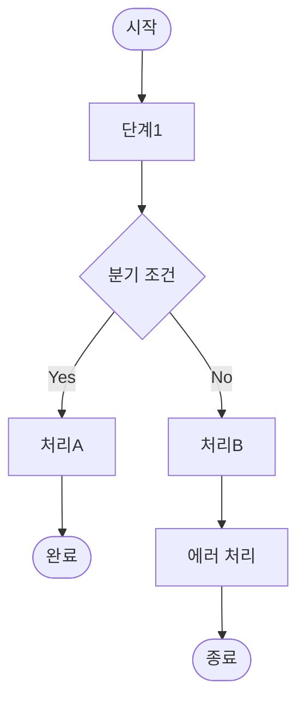

# /flow-design
> 기능 명세/서비스 설명 → Mermaid 플로우 + 분기 조건 + 예외 처리 경로

## YAML 명세

```yaml
skill:
  id: flow-design
  name: 서비스 플로우 설계
  domain: po/스토리보드
  trigger:
    - "플로우 설계"
    - "서비스 플로우"
    - "정책 플로우"
    - "/flow-design"
  inputs:
    - "기능 명세 또는 서비스 설명"
    - "주요 분기 조건 (선택)"
  outputs:
    - path: "obsidian/03_Projects/[domain]/[work]/flow-design-[date].md"
      type: md
    - path: context/events.jsonl
      type: log
  passes:
    - "서비스 플로우 Mermaid 포함됨"
    - "분기 조건(if/else) 정의됨"
    - "예외/에러 처리 경로 있음"
  reviewer: passes 항목 체크 후 APPROVE/REVISE
```

## 트리거

- `/flow-design` — 직접 실행
- `플로우 설계` — 서비스/기능 플로우 설계
- `서비스 플로우` — 서비스 전체 흐름 설계
- `정책 플로우` — 비즈니스 정책 흐름 (결제 정책, 정산 정책 등)

## 실행 순서

### Step 1. 플로우 범위 확인
기능 명세에서 추출:
- 시작점 (Trigger)
- 주요 처리 단계
- 종료점 (Success / Failure)
- 핵심 분기 조건

**출력:** 플로우 구성 요소 목록

### Step 2. Mermaid flowchart 생성
Happy Path 우선 작성 후 분기/예외 추가:


**출력:** Mermaid flowchart 코드

### Step 3. 분기 조건 정의
각 분기점(다이아몬드 노드)에 대해:
- 조건 명확히 기술
- Yes/No 또는 다중 조건

**출력:** 분기 조건 목록

### Step 4. 예외/에러 처리 경로 정의
- 시스템 에러 (타임아웃, 연결 실패)
- 비즈니스 에러 (잔액 부족, 권한 없음)
- 각 에러별 처리 방식

**출력:** 에러 처리 경로

### Step 5. Reviewer — passes 조건 체크

```
Worker 산출물
  → Reviewer (passes 조건 1:1 대조)
    APPROVE → 저장 + 텔레그램 알림
    REVISE  → Worker 재실행 (최대 3회)
    REJECT  → Stuck Detector 발동
```

**Stuck Detector 텔레그램 포맷:**
```
[STUCK] flow-design | retry=[count]회
실패 조건: [failed_passes]
마지막 오류: [error]
→ 직접 개입 필요
```

### Step 6. Obsidian 저장
파일명: `flow-design-[YYYY-MM-DD].md`
저장 경로: `obsidian/03_Projects/[domain]/[work]/`

## 출력 형식

```
## /flow-design 완료

# [서비스/기능명] 플로우 설계

## 플로우 다이어그램


## 분기 조건 정의
| 분기점 | Yes 조건 | No 조건 |
|--------|---------|---------|
| [조건1] | [처리A] | [처리B] |

## 예외/에러 처리
| 에러 유형 | 조건 | 처리 방식 |
|----------|------|----------|
| [에러1] | [조건] | [처리] |

passes:
✅ 서비스 플로우 Mermaid 포함됨
✅ 분기 조건(if/else) 정의됨
✅ 예외/에러 처리 경로 있음

저장: obsidian/03_Projects/[domain]/[work]/flow-design-[date].md
```

## passes 조건

| 조건 | 확인 방법 |
|------|----------|
| Mermaid 포함 | flowchart 코드 블록 존재 |
| 분기 조건 정의 | 다이아몬드{} 노드 + 조건 레이블 존재 |
| 예외 처리 경로 | 에러 처리 섹션 또는 노드 존재 |

## 사용 예시

```
/flow-design
EV 충전 결제 플로우: 충전 시작 → 결제 수단 확인 → 충전 진행 → 결제 처리 → 완료
```

## 트리거 제외

- 화면 전환 흐름 → /prototype-flow 사용
- API 시퀀스 → /diagram-gen sequence 사용
