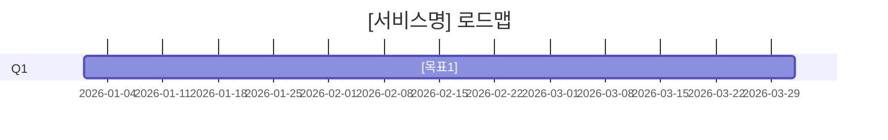

# /roadmap
> 기간 + 목표 목록 → 분기별 그룹핑 + 우선순위 + Mermaid 간트 로드맵

## YAML 명세

```yaml
skill:
  id: roadmap
  name: 로드맵
  domain: po/스프린트
  trigger:
    - "로드맵"
    - "분기 계획"
    - "roadmap"
    - "/roadmap"
  inputs:
    - "기간 (분기/반기 + 시작 날짜)"
    - "백로그 기반 또는 수동 목표 목록"
    - "우선순위 기준 (선택, 기본: RICE)"
  outputs:
    - path: "obsidian/03_Projects/[domain]/roadmap-[date].md"
      type: md
    - path: context/events.jsonl
      type: log
  passes:
    - "분기별 목표 그룹핑됨"
    - "각 목표에 우선순위 명시됨"
    - "Mermaid 간트 또는 텍스트 형식 로드맵 포함됨"
  reviewer: passes 항목 체크 후 APPROVE/REVISE
```

## 트리거

- `/roadmap` — 직접 실행
- `로드맵` — 로드맵 생성 요청
- `분기 계획` — 분기 단위 계획 수립
- `roadmap` — 영어 명령어

## 실행 순서

### Step 1. 기간 및 목표 파싱
- 분기/반기 기간 확인
- 목표 목록 정리
- 백로그 연동 시 RICE 기준 정렬

**출력:** 기간 + 목표 목록

### Step 2. 분기별 그룹핑
목표를 분기 단위로 배치:
- Q1/Q2/Q3... 또는 월 단위
- 의존성 고려한 순서 배치
- 각 분기 핵심 목표 1~3개

**출력:** 분기별 목표 그룹

### Step 3. 우선순위 명시
각 목표에:
- High/Medium/Low 또는 RICE 점수
- 핵심 마일스톤 표시

**출력:** 우선순위 레이블 추가된 목표 목록

### Step 4. Mermaid 간트 생성
```
gantt
  title [서비스명] 로드맵 [기간]
  dateFormat YYYY-MM-DD
  section Q1
    [목표1] :a1, 2026-01-01, 90d
```

**출력:** Mermaid gantt 코드

### Step 5. Reviewer — passes 조건 체크

```
Worker 산출물
  → Reviewer (passes 조건 1:1 대조)
    APPROVE → 저장 + 텔레그램 알림
    REVISE  → Worker 재실행 (최대 3회)
    REJECT  → Stuck Detector 발동
```

**Stuck Detector 텔레그램 포맷:**
```
[STUCK] roadmap | retry=[count]회
실패 조건: [failed_passes]
마지막 오류: [error]
→ 직접 개입 필요
```

### Step 6. Obsidian 저장
파일명: `roadmap-[YYYY-MM-DD].md`
저장 경로: `obsidian/03_Projects/[domain]/`

## 출력 형식

```
## /roadmap 완료

# [서비스명] 로드맵 ([기간])

## Q1 목표
- [HIGH] [목표1]
- [MEDIUM] [목표2]

## Q2 목표
- [HIGH] [목표3]

## 로드맵 시각화



passes:
✅ 분기별 목표 그룹핑됨
✅ 각 목표에 우선순위 명시됨
✅ Mermaid 간트 로드맵 포함됨

저장: obsidian/03_Projects/[domain]/roadmap-[date].md
```

## passes 조건

| 조건 | 확인 방법 |
|------|----------|
| 분기별 그룹핑 | Q1/Q2 등 섹션 존재 + 목표 목록 |
| 우선순위 명시 | HIGH/MEDIUM/LOW 또는 RICE 레이블 존재 |
| Mermaid 간트 | gantt 코드 블록 또는 텍스트 로드맵 존재 |

## 사용 예시

```
/roadmap 2026 상반기
목표: nexus v8 출시, openNexus 공개, 채용 포트폴리오 완성
```

## 트리거 제외

- 단일 스프린트 계획 → /backlog-sprint 사용
- 스프린트 회고 → /retro 사용
