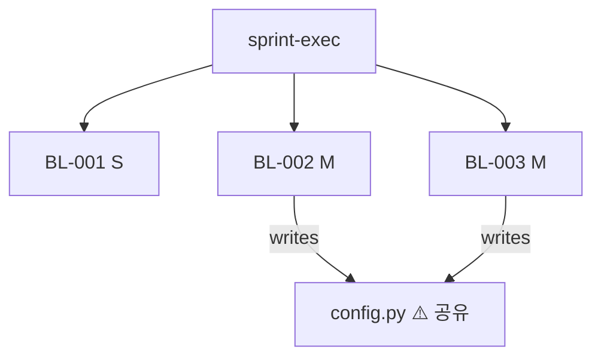

# /sprint-exec
> 스프린트 배치 spec 오케스트레이터 — Tier 분류 → 병렬/직렬 실행 → 스크럼 추적

## reentrancy — 중단 후 재개 (v8.1)

스프린트 실행 중 중단 시 `~/.claude/cache/sprint-state.json`에 상태 저장.

**상태 파일 스키마:**
```json
{
  "sprint_id": "SP-010",
  "current_item_id": "BL-076",
  "current_step": 3,
  "last_completed_step": 2,
  "status": "in_progress",
  "updated_at": "ISO8601"
}
```

**재개 규칙:**
1. sprint-exec 시작 시 sprint-state.json 존재 확인
2. 존재 시: `last_completed_step + 1`부터 재개 (중복 실행 방지)
3. 완료 시: sprint-state.json 삭제
4. 손상(JSON 파싱 오류) 시: 파일 삭제 + 처음부터 재시작

## rollback — half-changed 파일 복구 (v8.1)

스텝 실패로 파일이 불완전하게 수정된 경우:

```bash
# 1. 변경된 파일 목록 확인
git status --short

# 2. 신규 파일(반완성) → 삭제
git clean -f [신규 파일]

# 3. 기존 파일 수정 실패 → 원복
git checkout -- [수정 파일]

# 4. 완전 rollback (전체)
git stash
```

**rollback 트리거:**
- 스텝 실패 + 파일 변경 감지 → 자동 rollback 시도
- rollback 완료 → 텔레그램: "[스텝명] rollback 완료. 다음 시도 준비됨."
- rollback 실패 (git 충돌) → 수동 해결 요청 + Stuck Detector 발동

## 검증 게이트
⛔ **run_tests.sh PASS 10/10 확인 전 실제 스프린트 항목 실행 금지**
```bash
bash ~/.claude/skills/sprint-exec/run_tests.sh
```
첫 실행 시 dry-run 권장: 실제 spec-action/spec-build 호출 없이 Tier 분류 + 플랜만 출력.

---

## 사람이 해야 하는 것
- 어드바이저 검토 결과 → 문제 항목 해결 확인 후 ok
- Tier 분류표 + capacity 확인 1회 → ok
- blocked 항목 수동 해결

---

## Tier 기준

| Tier | file_count | 처리 방식 | 에이전트 |
|------|-----------|-----------|---------|
| S | 1~2개 | 글로벌 직렬 | Claude 직접 |
| M | 3~6개 | background 병렬 (최대 2개 동시) | Sonnet subagent |
| L | 7개+ / 아키텍처 변경 | background 순차 | Opus subagent |

**Tier 판단 불가 시: M으로 기본값** (안전하게 더 상세 처리)

## 처리유형 기준 (S 항목 전용)

| 처리유형 | 기준 | 실행 흐름 |
|---------|------|---------|
| 즉시처리 | 수정 파일 1~2개 + 신규 로직 없는 버그픽스·키수정·설정변경 | 코드 수정 → syntax 검증 → completed |
| 단독spec | 신규 함수·기능 추가 / 로직 변경 / 3파일+ | spec-action → spec-build → run_tests.sh → spec-up |

분류 불가 시: 단독spec으로 기본값

---

## capacity 계산

```
capacity = S항목수×1 + M항목수×3 + L항목수×5
권장: 20 이하 (초과 시 스프린트 분리 권고)
```

---

## 타임아웃 설정

| 항목 | timeout | 초과 시 |
|------|---------|---------|
| S 항목 전체 | 600s | 해당 항목 failed + 다음 계속 |
| M subagent | 600s | status=timeout, 재시도 없음 |
| L subagent | 1200s | status=timeout, 재시도 없음 |

---

## 실행 순서

### Step 0. 전제 조건 게이트

```
① ~/.nexus8/backlog.json 존재 확인
② active 스프린트 존재 확인
③ 스프린트 항목 1개 이상 확인
④ ~/.claude/cache/sprint-exec/ 디렉토리 생성
```

실패 시:
```
⛔ sprint-exec 중단
backlog.json 없음 → 파일 확인
active 스프린트 없음 → /backlog-sprint activate 먼저
항목 0개 → 스프린트에 항목 추가 필요
```

**doc-sync 게이트 (자동):**
/doc-sync 실행 → 브레이킹 참조 확인

```
PASS → Step 0.5 진행
FAIL → 브레이킹 목록 출력 + "수정 후 진행하거나 ok로 무시하고 계속"
```

### Step 0.5. 어드바이저 사전 검토

advisor() 호출 → 스프린트 항목 전체 자동 검토:

- 원인 미확정인 항목 있는가? (에러 로그·코드 미확인 상태)
- 항목 간 동일 파일 수정 충돌 있는가?
- 조건·의도 불명확 항목 있는가?
- description·acceptance_criteria 없는 항목 있는가?

```
문제 발견 시:
  → 문제점 목록 사람에게 보고
  → 각 문제 해결 확인 후 "ok" → Step 0.75 진행

문제 없으면:
  → "어드바이저 검토 완료 — 이슈 없음" 출력 → Step 0.75 자동 진행
```

### Step 0.75. scope-scan — 영향 범위 사전 탐색

스프린트 항목 title·description에서 파일명·키워드 추출 → /scope-scan 실행:

1. 항목별 연관 파일 rg 전수 탐색
2. 레거시 후보(참조 0건 파일) 발견 시 → 삭제 여부 확인
3. 항목 간 동일 파일 수정 충돌 탐지
4. Mermaid 의존도 다이어그램 출력

```
scope-scan PASS → Step 1 자동 진행
레거시 발견   → 확인 요청 후 진행
충돌 발견     → 항목 실행 순서 조정 후 진행
```

### Step 1. 스프린트 플래닝

1. backlog.json → active 스프린트 항목 로드
2. 항목별 Tier 자동 분류 (lib.sh `tier_classify`)
3. S 항목은 처리유형(즉시처리/단독spec) 추가 분류
4. capacity 계산
5. 분류표 출력:

```
## 스프린트 플래닝: [sprint-id]
ID       도메인  RICE   Tier  처리유형    처리방식
────────────────────────────────────────────────
BL-262   work   ★90    S    즉시처리    글로벌 직렬
BL-285   nexus  ★72    M    단독spec    Sonnet background
BL-261   work   ★48    M    단독spec    Sonnet background
...
capacity: 10/20 ✅

→ ok 입력 시 실행 시작
```

### Step 1.5. 실행 다이어그램 생성 — cross-item 충돌 시각화

플래닝 완료 후 항목 간 관계를 다이어그램으로 시각화:

`~/projects/_libs/diagrams/ai-patterns.md` → **agent-dag + fan-out-fan-in** 패턴 사용.

1. 항목별 수정 파일 목록 추출 (description·title 기반)
2. 항목 간 공유 파일 교차 확인 → 다이어그램에 표시
3. M 병렬 항목 중 동일 파일 수정 시 → 충돌 노드 강조



gate_check:

- 공유 파일에 M 항목 2개+ 쓰기 → 실행 순서 조정 또는 순차 전환
- 고아 항목(의존성 끊김) 없는지 확인

```
충돌 없음 → Step 2 진행
충돌 발견 → 항목 순서 조정 후 다이어그램 재확인
```

### Step 2. DoD 생성 + contracts 검증

항목별 `~/.claude/cache/sprint-exec/[BL-ID]-dod.md` 자동 생성.
(lib.sh `create_dod` 함수 사용)

단독spec 항목 실행 전 `~/.claude/skills/contracts/ab-test.criteria.md` 로드:

- 작업 유형(CLI/스크립트/설정) 감지 → 해당 판정 기준 적용
- A/B compare 시 이 기준으로 IMPROVED/NEUTRAL/DEGRADED 판정

DoD + contracts 검증 완료 → Step 3 진행

### Step 3. 실행

#### S 항목 (글로벌 직렬)

```
for each S item:
  if 처리유형 == "즉시처리":
    코드 수정
    python3 -m py_compile [수정파일] → syntax 검증
    backlog_update_status(BL-ID, "completed")
    burndown_update(BL-ID, rice_score)
    텔레그램: "[BL-ID] 완료 ✅ (즉시처리)"

  elif 처리유형 == "단독spec":
    slug = make_slug(BL-ID, title)
    spec-action(slug=slug) → spec-action-[slug]-latest.md 저장
    /ab-test baseline --target BL-ID          ← 구현 전 기준선 캡처
    spec-build → TEST-SPEC.md + run_tests.sh → PASS
    /ab-test compare --target BL-ID           ← 구현 후 비교
      IMPROVED  → spec-up 진행
      NEUTRAL   → 사용자 판단 후 진행
      DEGRADED  → status=blocked, 텔레그램 알림, /debug 권장
    spec-up → backlog_update_status(BL-ID, "completed")
    burndown_update(BL-ID, rice_score)
    텔레그램: "[BL-ID] 완료 ✅ (판정: IMPROVED/NEUTRAL)"
```

예외:

- 즉시처리 syntax 오류 → 수정 후 재검증, 2회 실패 시 `status=blocked`
- 단독spec spec-build 3회 FAIL → `status=blocked`, 텔레그램 알림, 다음 항목 계속
- A/B compare DEGRADED → `status=blocked`, /debug 권장, 다음 항목 계속
- 600s 초과 → `status=failed`, 다음 항목 계속

#### M 항목 (Sonnet subagent, 최대 2개 병렬)

```
queue = M 항목 목록
running = []
completed = []

while queue or running:
  while len(running) < 2 and queue:
    item = queue.pop(0)
    persona_prefix = build_persona_prefix(item.domain, "M")  # lib.sh
    agent = Agent(
      subagent_type="general-purpose",  # Sonnet
      model="sonnet",
      run_in_background=True,
      prompt=persona_prefix + M_PROMPT(item, slug)
    )
    running.append((item, agent))

  # 완료된 에이전트 감지: sprint-exec-state.json에서 status=completed 확인
  for item, agent in list(running):
    state = read_sprint_exec_state(item.id)
    if state.status in ("completed", "blocked", "failed", "timeout"):
      running.remove((item, agent))
      completed.append((item, agent))

  # 완료 처리
  for item, agent in completed:
    backlog_update_status(item.id, "completed")
    burndown_update(item.id, item.rice_score)
    텔레그램: "[BL-ID] 완료 ✅ (Sonnet)"
  completed.clear()
```

M subagent 프롬프트 필수 포함:
- BL-ID, slug, spec-action 출력 경로
- spec-define → spec-action(slug) → /ab-test baseline → spec-build → /ab-test compare → IMPROVED 확인 → spec-up 전체 실행
- 완료 시 `status=completed` 기록 위치 명시
- 600s 타임아웃

#### L 항목 (Opus subagent, 순차)

```
for each L item:
  persona_prefix = build_persona_prefix(item.domain, "L")  # lib.sh
  agent = Agent(
    model="opus",
    run_in_background=True,
    prompt=persona_prefix + L_PROMPT(item, slug)
  )
```

L subagent 내부:
1. spec-define 전체 실행 (PRD + plan.md)
2. spec-hardening (ownership-map)
3. **/ab-test baseline** — 구현 전 기준선 캡처
4. **spec-build** (Claude 직접 구현)
5. **/ab-test compare** → contracts/ab-test.criteria.md 기준 판정
   - IMPROVED / NEUTRAL → spec-up 진행
   - DEGRADED → status=blocked, 텔레그램 알림
6. spec-up
7. 완료 시 backlog 갱신 + 텔레그램

### Step 4. 완료 처리

- 항목 완료마다: `backlog_update_status` + `burndown_update` (atomic write)
- `sprint-exec-state.json` 실시간 갱신

### Step 5. 전체 완료

```
retro_trigger(sprint_id, done, total, rice_done)

# A-2: 완료 감지 연동 (순서 중요: 텔레그램 먼저 → 스크립트)
# 프로젝트별 rice_scorer, retrospect 스크립트 경로를 config.sh에서 설정

텔레그램 최종 리포트:
  "SP-XXXX 완료
   진행: N/M [██████████]
   RICE 소화: XXXX
   A/B: IMPROVED N개 / NEUTRAL N개 / DEGRADED N개
   blocked: N개
   소요: XX분"
```

### Step 6. 릴리즈 노트 + 문서 현행화 (자동)

스프린트 완료 시 `$NEXUS_VAULT/03_Projects/nexus/RELEASE-NOTES.md` 덮어쓰기.

```markdown
# 넥서스 릴리즈 노트
버전: [CHANGELOG vX.Y] | [날짜] | [스프린트 ID]

## 이번 스프린트에서 달라진 것
- [완료 항목별 한 줄 요약]

## Before / After
| 항목 | Before | After |
|------|--------|-------|
| ... | ... | ... |

## 확인 포인트
- [ ] [검증 항목]

## 다음 스프린트 예정
- [todo[] 상위 3개]
```

- 내용은 완료된 BL 항목 title + 실제 변경 효과 기반으로 자동 생성
- 이전 RELEASE-NOTES.md 덮어쓰기 (누적 아님)
- 생성 후 경로 텔레그램 전송: "릴리즈 노트: $NEXUS_VAULT/03_Projects/nexus/RELEASE-NOTES.md"

#### 문서 현행화 (자동)

스프린트 완료 시 수정된 파일 기준으로 관련 문서 일괄 갱신:

1. **프로젝트 spec.md** — 수정된 에이전트/스크립트가 속한 obsidian spec 파일 버전·날짜 갱신
2. **TEST-SPEC.md** — 신규 기능·버그픽스에 대응하는 테스트 케이스 추가
3. **AGENTS.md** — 신규 에이전트 파일 추가 시 목록 갱신
4. **checkpoint.json** — `domains.[도메인]` 한 줄 현행화

문서 현행화 완료 후 텔레그램 전송:
"문서 현행화 완료: [갱신된 파일 목록]"

**파이프라인 건전성 검증 (자동):**
/simulation-tests 실행 → 스킬 체인 3개 검증

```text
3/3 PASS → 다음 스프린트 준비 완료
FAIL 있음 → 실패 체인 + 원인 텔레그램 전송
            다음 스프린트 전 수동 수정 권장
```

---

## 예외처리 전체

| 상황 | 처리 |
|------|------|
| spec-action 실패 | `status=failed` + 다음 항목 계속 |
| spec-build 3회 FAIL | `status=blocked` + 텔레그램 즉시 알림 |
| Codex 타임아웃 | Claude fallback + 텔레그램 "[BL-ID] Codex → Claude fallback" |
| subagent 타임아웃 | `status=timeout`, 재시도 없음 + 텔레그램 |
| backlog.json 동시 쓰기 | tmp + atomic mv (lib.sh `backlog_update_status`) |
| M 병렬 2개 초과 | 큐잉 → 앞 항목 완료 시 자동 시작 |
| 스프린트 항목 없음 | 즉시 중단 + 안내 |

---

## 스크럼 5요소 통합

| 스크럼 이벤트 | 구현 위치 |
|---|---|
| 스프린트 플래닝 | Step 1 (Tier + capacity) |
| DoD | Step 2 (항목별 dod.md) |
| 번다운 | Step 4 (sprint-exec-state.json) |
| 레트로 트리거 | Step 5 (checkpoint.json todo[]) |
| 데일리 스크럼 | daily-scrum.sh (독립 cron 09:00 KST) |

---

## 파일 경로

```
~/.claude/skills/sprint-exec/
├── SKILL.md          ← 이 파일
├── lib.sh            ← 헬퍼 함수
├── run_tests.sh      ← TDD 검증
├── TEST-SPEC.md      ← 테스트 케이스
└── fixtures/
    └── backlog-mock.json

~/.claude/cache/sprint-exec/
├── sprint-exec-state.json          ← 번다운 상태
├── [BL-ID]-dod.md                  ← 항목별 DoD
└── spec-action-[slug]-latest.md    ← 항목별 명세

~/.claude/hooks/daily-scrum.sh      ← cron 09:00 KST
```
